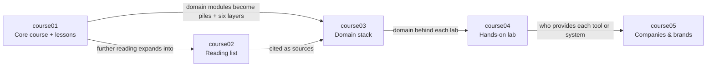

# Abap — ABAP Programming Learning Project

[← Labrador project map](../index.md) · [Course templates](course-templates/README.md)

> Five courses that teach ABAP, SAP's programming language, as one discipline organized around eight domains — language core, data dictionary, Open SQL & CDS, modularization & OO, UI, integration & interfaces, performance, and testing & quality: theory and lessons, reading, the domain stack (eight piles, six layers, three pillars), a hands-on lab, and the companies behind the tools. **Status:** draft structure only — every course `index.md` is a header; the domains are **proposed — needs approval**, and every other entry in the tree below is planned.

## Project structure

```
Abap/
├── README.md                              ← project map (this file)
├── course-templates/                      ← start every new course file here
│   ├── README.md                            how templates map to files, follow-up edits
│   ├── lesson.md                            → version/course01/LessonN.md
│   ├── course02-resource.md                 → version/course02/NN-author-short-title/README.md
│   ├── course03-domain.md                   → version/course03/NN-domain/README.md
│   ├── course04-bench.md                    → version/course04/NN-bench-domain.md
│   ├── course05-company.md                  → version/course05/NN-category/company.md
│   └── course-index.md                      → version/courseNN/index.md
└── version/
    ├── course01/                          Core course — header only
    │   ├── index.md
    │   ├── Lesson1.md                       planned · 01 Language core
    │   ├── Lesson2.md                       planned · 02 Data dictionary
    │   ├── Lesson3.md                       planned · 03 Open SQL & CDS
    │   ├── Lesson4.md                       planned · 04 Modularization & OO
    │   ├── Lesson5.md                       planned · 05 UI
    │   ├── Lesson6.md                       planned · 06 Integration & interfaces
    │   ├── Lesson7.md                       planned · 07 Performance
    │   ├── Lesson8.md                       planned · 08 Testing & quality
    │   └── Lesson9.md …                     planned · lessons across domains (open)
    ├── course02/                          Reading list — header only
    │   ├── index.md
    │   └── NN-author-short-title/README.md  planned; one folder per resource, none chosen
    ├── course03/                          Domain stack — header only
    │   ├── index.md
    │   ├── p1-….md · p2-….md · p3-….md      planned; pillars open
    │   ├── 01-language-core/README.md       planned
    │   ├── 02-data-dictionary/README.md     planned
    │   ├── 03-sql-and-cds/README.md         planned
    │   ├── 04-modularization-and-oo/README.md  planned
    │   ├── 05-ui/README.md                  planned
    │   ├── 06-interfaces/README.md          planned
    │   ├── 07-performance/README.md         planned
    │   ├── 08-testing-and-quality/README.md planned
    │   └── 09-integration.md                planned · integration pile
    ├── course04/                          Hands-on lab — header only
    │   ├── index.md
    │   ├── 00-starter-kit.md                planned · system access and tools (open)
    │   ├── 01-bench-language-core.md        planned
    │   ├── 02-bench-data-dictionary.md      planned
    │   ├── 03-bench-sql-and-cds.md          planned
    │   ├── 04-bench-modularization-and-oo.md  planned
    │   ├── 05-bench-ui.md                   planned
    │   ├── 06-bench-interfaces.md           planned
    │   ├── 07-bench-performance.md          planned
    │   └── 08-bench-testing-and-quality.md  planned
    └── course05/                          Companies & brands — header only
        ├── index.md
        └── NN-category/                     planned; categories open
            ├── index.md
            └── company.md                   one per company
```

**Conventions**

- Every course folder opens at `index.md`, which states the course's role, what it builds on and what it feeds into, with links to the previous and next course.
- Domain numbers are the same in every course (**proposed — needs approval**): `01` language core · `02` data dictionary · `03` Open SQL & CDS · `04` modularization & OO · `05` UI · `06` integration & interfaces · `07` performance · `08` testing & quality. course03 adds `p1`–`p3` (the three pillars) and `09` (integration pile, since `08` is a domain here); course04 adds `00` (starter kit). course01 Lessons 1–8 follow the same numbers; lessons and modules across domains are open.
- Folder and file slugs: `language-core` · `data-dictionary` · `sql-and-cds` · `modularization-and-oo` · `ui` · `interfaces` · `performance` · `testing-and-quality`. Domain 06 uses `interfaces`, not `integration`, so it can't be confused with the course03 integration pile.
- course02 is numbered by reading priority, not by domain.
- Every domain file links to the same domain in the other courses; links to files that don't exist yet are plain text until they do.
- New course files start from [course-templates/](course-templates/README.md); its destinations are relative to `Abap/`.
- Unknown facts are "—", never guessed.

## The five courses

| Course | Role | What it is | Builds on | Feeds into |
|---|---|---|---|---|
| [course01](version/course01/index.md) | Core course | Theory spine and one lesson per domain (nine steps each) — title, modules and lessons across domains open | — | course02, course03, course04, course05 |
| [course02](version/course02/index.md) | Reading list | Books, documentation and videos, one folder each, numbered by reading priority — none chosen | course01 (further reading) | course03 (sources), course01 (section 9 of every lesson) |
| [course03](version/course03/index.md) | Domain stack | Three pillars, then one file per domain — hands-on pile (A–C), six layers, back to the lab (D–G) — then the integration pile | course01, course02 | course04, course05 |
| [course04](version/course04/index.md) | Hands-on lab | Starter kit + eight labs, each with four builds — the lab format (likely exercises on an SAP trial or ABAP environment, not a costed BOM) is open | course03 | Your own system and notebook, course05 |
| [course05](version/course05/index.md) | Companies & brands | One folder per category, one file per company cited in courses 01–04 — categories open | course01, course03, course04 | course04 (where to get each tool or system) |

## How the courses interact



## Domain cross-reference

The same domain, in every course (**proposed — needs approval**):

| # | Domain | What it covers | Lesson (course01) | Domain stack (course03) | Lab (course04) | Books (course02) |
|---|---|---|---|---|---|---|
| 1 | Language core | Syntax, data types, internal tables, control flow, strings | planned: `course01/Lesson1.md` | planned: `course03/01-language-core/README.md` | planned: `course04/01-bench-language-core.md` | — |
| 2 | Data dictionary | Domains, data elements, tables, structures, views, search helps | planned: `course01/Lesson2.md` | planned: `course03/02-data-dictionary/README.md` | planned: `course04/02-bench-data-dictionary.md` | — |
| 3 | Open SQL & CDS | Database access from ABAP and Core Data Services views | planned: `course01/Lesson3.md` | planned: `course03/03-sql-and-cds/README.md` | planned: `course04/03-bench-sql-and-cds.md` | — |
| 4 | Modularization & OO | Function modules, classes, interfaces, exceptions | planned: `course01/Lesson4.md` | planned: `course03/04-modularization-and-oo/README.md` | planned: `course04/04-bench-modularization-and-oo.md` | — |
| 5 | UI | Classic dynpro and ALV through to Fiori / UI5 front ends | planned: `course01/Lesson5.md` | planned: `course03/05-ui/README.md` | planned: `course04/05-bench-ui.md` | — |
| 6 | Integration & interfaces | RFC, BAPIs, IDocs, OData and other services | planned: `course01/Lesson6.md` | planned: `course03/06-interfaces/README.md` | planned: `course04/06-bench-interfaces.md` | — |
| 7 | Performance | Runtime analysis, SQL tracing, buffering, efficient table handling | planned: `course01/Lesson7.md` | planned: `course03/07-performance/README.md` | planned: `course04/07-bench-performance.md` | — |
| 8 | Testing & quality | ABAP Unit, static checks, code review, transport and versioning | planned: `course01/Lesson8.md` | planned: `course03/08-testing-and-quality/README.md` | planned: `course04/08-bench-testing-and-quality.md` | — |
| — | All domains | — | planned: lessons across domains (open) | planned: pillars `p1`–`p3` · `course03/09-integration.md` | planned: `course04/00-starter-kit.md` | — |

"What it covers" is a draft scope for each proposed domain, to confirm with the domain list. Companies: [course05](version/course05/index.md) — none listed yet.

## Open questions

- **Domains — proposed, needs approval.** The eight domains above, their order, names and slugs are a draft; no domain list was given. Possible changes: split or merge (e.g. Open SQL and CDS as separate domains; UI split into classic and Fiori), add a domain (e.g. the RAP programming model, enhancements and modifications, security and authorizations, background processing), or rename `06-interfaces`.
- **Benches and BOMs** — Labrador's benches are physical kits costed as a multilevel BOM. For ABAP the likely replacement is a hands-on lab on an SAP trial or ABAP environment (e.g. an SAP BTP ABAP environment trial or a locally installed ABAP Platform trial — which one, and whether both are covered, is not decided). Open: what the starter kit holds (system access, IDE, other tools), whether anything is costed, what replaces the BOM code `bench.category.item`, and what replaces the free "teardown targets" category (perhaps reading existing standard SAP code).
- **course05 categories** — e.g. SAP itself, implementation partners and consultancies, tool vendors, training and certification providers, hosting and cloud providers, open-source projects (which aren't companies)? Not decided.
- **Lessons and modules across domains** — Labrador and Zafiro have three lessons across domains (foundations, cross-domain, integration). How many does Abap have, and what are they?
- **Pillars** — Labrador's three pillars (arrows between piles, material + technique, bandwidth and ceiling) are about energy domains. What are Abap's?
- **Six layers** — vocabulary → measurement → discovery → material → technique → features fits physical effects; does it hold for a programming language, or do layers need renaming (e.g. measurement → tooling, material → runtime / platform)?
- **Effort · flow · power** — the course03 domain header line has no counterpart for ABAP; replace with key concepts or drop.
- **Release scope** — which ABAP releases and language versions the courses target (classic on-premise ABAP, ABAP Cloud, or both).
- **course02 resources** — none chosen.
- **Project name** — the folder is `Abap/`; the project's display name and course01's title are open.
