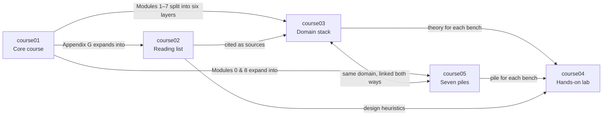

# Labrador — Sensors & Actuators Learning Project

> Five courses that teach sensors and actuators as one discipline organized around seven physical domains: theory, reading, a layer-by-layer domain stack, a hands-on lab, and the seven piles with their three pillars.

## Project structure

```
Labrador/
├── index.md                         ← project map (this file)
└── version/
    ├── course01/  index.md                          Core course
    ├── course02/  index.md + 9 resource folders     Reading list
    ├── course03/  index.md + 7 domain folders       Domain stack
    ├── course04/  index.md + 8 bench files          Hands-on lab
    └── course05/  index.md + 3 pillars + 8 piles    Seven piles
```

**Conventions**

- Every course folder opens at `index.md`, which states the course's role, what it builds on and what it feeds into, with links to the previous and next course.
- Domain numbers are the same in every course: `01` electrical · `02` magnetic · `03` mechanical · `04` fluidic · `05` thermal · `06` chemical · `07` radiant. course04 adds `00` (starter kit); course05 adds `08` (integration pile) and `p1`–`p3` (the three pillars).
- course02 is numbered by reading priority, not by domain.
- Every domain file links to the same domain in the other courses.

## The five courses

| Course | Role | What it is | Builds on | Feeds into |
|---|---|---|---|---|
| [course01](version/course01/index.md) | Core course | *Physical Domains in Sensors & Actuators* — Modules 0–9 and Appendices A–G | — | course02, course03, course04, course05 |
| [course02](version/course02/index.md) | Reading list | Nine books and video series, plus [design heuristics](version/course02/09-gelbart-videos/design.md) | course01 Appendix G | course03 (sources), all courses (heuristics) |
| [course03](version/course03/index.md) | Domain stack | Each domain by six layers: Vocabulary → Measurement → Discovery → Material → Technique → Features | course01 Modules 1–7, course02 | course04, course05 |
| [course04](version/course04/index.md) | Hands-on lab | Starter kit + seven benches, each with a multilevel BOM, teardowns and three builds | course03, course05 | Your lab notebook |
| [course05](version/course05/index.md) | Seven piles | Three pillars (arrows between piles · material + technique · bandwidth and ceiling), then one hands-on pile per domain with its terms and reference tables, then the integration pile | course01 Modules 0 and 8, course04 | course03, course04 |

## How the courses interact



- **course01 → course03:** each domain module is rearranged into the six layers; course03 links back to the module.
- **course01 → course05:** the domain modules and the cross-domain analogy table are retold bench-first as seven piles, organized by three pillars.
- **course02 → course03:** each domain file cites its books.
- **course03 + course05 → course04:** every bench links to the theory (course03) and the pile (course05) for its domain.
- **course02 design heuristics → everything:** the rules apply when choosing parts on any bench and in the course01 capstone.

## Suggested study path

1. **Foundations** — [course01 Module 0](version/course01/index.md#module-0--foundations), then the [course05 index](version/course05/index.md) (the three pillars and the bench) and [Pillar 1 — Arrows between piles](version/course05/p1-arrows-between-piles.md).
2. **Domain by domain** — for each of the seven domains, in order:
   1. Read the course01 module.
   2. Work the pile in course05: look, understand, build, then the terms.
   3. Work through the six layers in course03.
   4. Set up the course04 bench: teardowns first, then the three builds.
   5. Go deeper with the course02 books for that domain.
3. **Across domains** — [course01 Module 8](version/course01/index.md#module-8--cross-domain-transducers) with [Pillar 2 — Material + technique](version/course05/p2-material-and-technique.md) and [Pillar 3 — Bandwidth and ceiling](version/course05/p3-bandwidth-and-ceiling.md).
4. **Integration & capstone** — [course01 Module 9](version/course01/index.md#module-9--integration--system-design) and the [design heuristics](version/course02/09-gelbart-videos/design.md), building on the benches you've set up. Start from the [integration pile](version/course05/08-integration.md).

## Domain cross-reference

The same domain, in every course:

| # | Domain | course01 | course03 | course04 | course05 | course02 books |
|---|---|---|---|---|---|---|
| 1 | Electrical | [Module 1](version/course01/index.md#module-1--electrical-domain) | [Stack](version/course03/01-electrical/README.md) | [Bench 1](version/course04/01-bench-electrical.md) | [Pile](version/course05/01-electrical.md) | [Horowitz & Hill](version/course02/04-horowitz-hill-art-of-electronics/) · [Fraden](version/course02/06-fraden-handbook-of-modern-sensors/) |
| 2 | Magnetic | [Module 2](version/course01/index.md#module-2--magnetic-domain) | [Stack](version/course03/02-magnetic/README.md) | [Bench 2](version/course04/02-bench-magnetic.md) | [Pile](version/course05/02-magnetic.md) | [Fraden](version/course02/06-fraden-handbook-of-modern-sensors/) |
| 3 | Mechanical | [Module 3](version/course01/index.md#module-3--mechanical-domain) | [Stack](version/course03/03-mechanical/README.md) | [Bench 3](version/course04/03-bench-mechanical.md) | [Pile](version/course05/03-mechanical.md) | [Slocum](version/course02/01-slocum-precision-machine-design/) · [Hale](version/course02/02-hale-designing-precision-machines/) · [Ashby](version/course02/03-ashby-materials-selection/) · [Gelbart](version/course02/09-gelbart-videos/) |
| 4 | Fluidic | [Module 4](version/course01/index.md#module-4--fluidic-domain) | [Stack](version/course03/04-fluidic/README.md) | [Bench 4](version/course04/04-bench-fluidic.md) | [Pile](version/course05/04-fluidic.md) | [Merritt](version/course02/05-merritt-hydraulic-control-systems/) |
| 5 | Thermal | [Module 5](version/course01/index.md#module-5--thermal-domain) | [Stack](version/course03/05-thermal/README.md) | [Bench 5](version/course04/05-bench-thermal.md) | [Pile](version/course05/05-thermal.md) | [Fraden](version/course02/06-fraden-handbook-of-modern-sensors/) |
| 6 | Chemical | [Module 6](version/course01/index.md#module-6--chemical-domain) | [Stack](version/course03/06-chemical/README.md) | [Bench 6](version/course04/06-bench-chemical.md) | [Pile](version/course05/06-chemical.md) | [Bard & Faulkner](version/course02/07-bard-faulkner-electrochemical-methods/) |
| 7 | Radiant | [Module 7](version/course01/index.md#module-7--radiant-domain) | [Stack](version/course03/07-radiant/README.md) | [Bench 7](version/course04/07-bench-radiant.md) | [Pile](version/course05/07-radiant.md) | [Hecht; Saleh & Teich](version/course02/08-hecht-saleh-teich-optics-photonics/) |
| — | All domains | [Modules 0, 8, 9](version/course01/index.md#module-0--foundations) | [Stack overview](version/course03/index.md) | [Starter kit](version/course04/00-starter-kit.md) | [Pillars 1–3](version/course05/p1-arrows-between-piles.md) · [Integration](version/course05/08-integration.md) | [Design heuristics](version/course02/09-gelbart-videos/design.md) |

## Contents

### [course01](version/course01/index.md) — Core course: *Physical Domains in Sensors & Actuators*

- [Module 0 — Foundations](version/course01/index.md#module-0--foundations)
- [Module 1 — Electrical Domain](version/course01/index.md#module-1--electrical-domain)
- [Module 2 — Magnetic Domain](version/course01/index.md#module-2--magnetic-domain)
- [Module 3 — Mechanical Domain](version/course01/index.md#module-3--mechanical-domain)
- [Module 4 — Fluidic Domain](version/course01/index.md#module-4--fluidic-domain)
- [Module 5 — Thermal Domain](version/course01/index.md#module-5--thermal-domain)
- [Module 6 — Chemical Domain](version/course01/index.md#module-6--chemical-domain)
- [Module 7 — Radiant Domain](version/course01/index.md#module-7--radiant-domain)
- [Module 8 — Cross-Domain Transducers](version/course01/index.md#module-8--cross-domain-transducers)
- [Module 9 — Integration & System Design](version/course01/index.md#module-9--integration--system-design)
- Appendices A–G: [timeline](version/course01/index.md#appendix-a--timeline-of-key-discoveries), [people](version/course01/index.md#appendix-b--people-index), [materials](version/course01/index.md#appendix-c--materials-index), [techniques](version/course01/index.md#appendix-d--techniques-index), [glossary](version/course01/index.md#appendix-e--glossary), [equipment lineage](version/course01/index.md#appendix-f--equipment-lineage), [further reading](version/course01/index.md#appendix-g--further-reading)

### [course02](version/course02/index.md) — Reading list

| # | Resource | Used by |
|---|---|---|
| 1 | [Slocum, *Precision Machine Design*](version/course02/01-slocum-precision-machine-design/) | Mechanical |
| 2 | [Hale, *Principles and Techniques for Designing Precision Machines*](version/course02/02-hale-designing-precision-machines/) | Mechanical |
| 3 | [Ashby, *Materials Selection in Mechanical Design*](version/course02/03-ashby-materials-selection/) | Mechanical |
| 4 | [Horowitz & Hill, *The Art of Electronics*](version/course02/04-horowitz-hill-art-of-electronics/) | Electrical |
| 5 | [Merritt, *Hydraulic Control Systems*](version/course02/05-merritt-hydraulic-control-systems/) | Fluidic |
| 6 | [Fraden, *Handbook of Modern Sensors*](version/course02/06-fraden-handbook-of-modern-sensors/) | Electrical, Magnetic, Thermal |
| 7 | [Bard & Faulkner, *Electrochemical Methods*](version/course02/07-bard-faulkner-electrochemical-methods/) | Chemical |
| 8 | [Hecht, *Optics*; Saleh & Teich, *Fundamentals of Photonics*](version/course02/08-hecht-saleh-teich-optics-photonics/) | Radiant |
| 9 | [Dan Gelbart's videos + [design.md](version/course02/09-gelbart-videos/design.md)](version/course02/09-gelbart-videos/) | Mechanical |

### [course03](version/course03/index.md) — Domain stack

| # | Domain | File |
|---|---|---|
| 1 | Electrical | [01-electrical/README.md](version/course03/01-electrical/README.md) |
| 2 | Magnetic | [02-magnetic/README.md](version/course03/02-magnetic/README.md) |
| 3 | Mechanical | [03-mechanical/README.md](version/course03/03-mechanical/README.md) |
| 4 | Fluidic | [04-fluidic/README.md](version/course03/04-fluidic/README.md) |
| 5 | Thermal | [05-thermal/README.md](version/course03/05-thermal/README.md) |
| 6 | Chemical | [06-chemical/README.md](version/course03/06-chemical/README.md) |
| 7 | Radiant | [07-radiant/README.md](version/course03/07-radiant/README.md) |

### [course04](version/course04/index.md) — Hands-on lab

| # | Bench | File |
|---|---|---|
| 0 | Universal Starter Kit | [00-starter-kit.md](version/course04/00-starter-kit.md) |
| 1 | Electrical | [01-bench-electrical.md](version/course04/01-bench-electrical.md) |
| 2 | Magnetic | [02-bench-magnetic.md](version/course04/02-bench-magnetic.md) |
| 3 | Mechanical | [03-bench-mechanical.md](version/course04/03-bench-mechanical.md) |
| 4 | Fluidic | [04-bench-fluidic.md](version/course04/04-bench-fluidic.md) |
| 5 | Thermal | [05-bench-thermal.md](version/course04/05-bench-thermal.md) |
| 6 | Chemical | [06-bench-chemical.md](version/course04/06-bench-chemical.md) |
| 7 | Radiant | [07-bench-radiant.md](version/course04/07-bench-radiant.md) |

### [course05](version/course05/index.md) — Seven piles, three pillars

| # | Topic | File |
|---|---|---|
| P1 | Pillar 1 — Arrows between piles | [p1-arrows-between-piles.md](version/course05/p1-arrows-between-piles.md) |
| P2 | Pillar 2 — Material + technique | [p2-material-and-technique.md](version/course05/p2-material-and-technique.md) |
| P3 | Pillar 3 — Bandwidth and ceiling | [p3-bandwidth-and-ceiling.md](version/course05/p3-bandwidth-and-ceiling.md) |
| 1 | Pile 1 — Electrical | [01-electrical.md](version/course05/01-electrical.md) |
| 2 | Pile 2 — Magnetic | [02-magnetic.md](version/course05/02-magnetic.md) |
| 3 | Pile 3 — Mechanical | [03-mechanical.md](version/course05/03-mechanical.md) |
| 4 | Pile 4 — Fluidic | [04-fluidic.md](version/course05/04-fluidic.md) |
| 5 | Pile 5 — Thermal | [05-thermal.md](version/course05/05-thermal.md) |
| 6 | Pile 6 — Chemical | [06-chemical.md](version/course05/06-chemical.md) |
| 7 | Pile 7 — Radiant | [07-radiant.md](version/course05/07-radiant.md) |
| 8 | The integration pile | [08-integration.md](version/course05/08-integration.md) |
