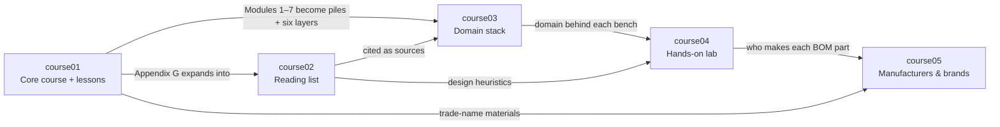

# Labrador — Sensors & Actuators Learning Project

> Five courses that teach sensors and actuators as one discipline organized around seven physical domains: theory and lessons, reading, the domain stack (seven piles, six layers, three pillars), a hands-on lab, and the manufacturers behind every part.

## Project structure

```
Labrador/
├── index.md                         ← project map (this file)
├── course-templates/                ← start every new course file here
├── scaffolding/                     ← app skeleton: Next.js + pnpm monorepo + Supabase
├── zafiro/                          ← Zafiro: mineral & gem courses (draft structure)
└── version/
    ├── course01/  index.md + Lesson1–10.md           Core course
    ├── course02/  index.md + 12 resource folders     Reading list
    ├── course03/  index.md + 3 pillars + 7 domains   Domain stack
    │              + integration pile
    ├── course04/  index.md + 8 bench files           Hands-on lab
    └── course05/  index.md + 7 category folders      Manufacturers & brands
```

**Conventions**

- Every course folder opens at `index.md`, which states the course's role, what it builds on and what it feeds into, with links to the previous and next course.
- Domain numbers are the same in every course: `01` electrical · `02` magnetic · `03` mechanical · `04` fluidic · `05` thermal · `06` chemical · `07` radiant. course03 adds `p1`–`p3` (the three pillars) and `08` (integration pile); course04 adds `00` (starter kit).
- course02 is numbered by reading priority, not by domain.
- Every domain file links to the same domain in the other courses.
- [scaffolding/](scaffolding/README.md) is the empty skeleton for a Labrador web app (benches, BOMs, inventory, costing; EN / PL / RU).
- New course files start from [course-templates/](course-templates/README.md): a lesson, a reading-list entry, a domain file, a bench, a company file or a course index, plus the list of other files to update.
- [zafiro/](zafiro/README.md) is a second project — mineral & gem courses in eight domains — laid out the same way, with its own project map and course templates; only its structure is drafted so far.

## The five courses

| Course | Role | What it is | Builds on | Feeds into |
|---|---|---|---|---|
| [course01](version/course01/index.md) | Core course | *Physical Domains in Sensors & Actuators* — Modules 0–9, Appendices A–G, and Lessons 1–10 (one per domain, plus three across domains; nine steps each) | — | course02, course03, course04, course05 |
| [course02](version/course02/index.md) | Reading list | Twelve books and video series, plus the single list of [design heuristics](version/course02/09-gelbart-videos/design.md) | course01 Appendix G | course03 (sources), all courses (heuristics) |
| [course03](version/course03/index.md) | Domain stack | Three pillars, then one file per domain — hands-on pile (look, understand, build, worked example) and six-layer stack (vocabulary → measurement → discovery → material → technique → features) — then the integration pile | course01, course02 | course04, course05 |
| [course04](version/course04/index.md) | Hands-on lab | Starter kit + seven benches, each with a multilevel BOM, teardowns and four builds | course03 | Your lab notebook, course05 |
| [course05](version/course05/index.md) | Manufacturers & brands | 64 companies in 7 categories — instruments, boards, chips, modules, motion and fluid power, material trade-name owners, suppliers — with products, BOM codes, material codes and every place they're cited | course01, course03, course04 | course04 (sourcing) |

## How the courses interact



- **course01 → course03:** each domain module becomes a course03 domain file — a hands-on pile plus the six layers — and every lesson links to it.
- **course02 → course03:** each domain file cites its books.
- **course03 → course04:** every bench links to the domain file behind it.
- **course04 → course05:** every part number, brand and supplier in the BOMs has a company file; each company file links back to every mention.
- **course02 design heuristics → everything:** the rules apply when choosing parts on any bench and in the course01 capstone.

## Suggested study path

1. **Foundations** — [course01 Lesson 8](version/course01/Lesson8.md) with [Module 0](version/course01/index.md#module-0--foundations), then the [course03 index](version/course03/index.md) (six layers, three pillars, the bench) and [Pillar 1 — Arrows between piles](version/course03/p1-arrows-between-piles.md).
2. **Domain by domain** — for each of the seven domains, in order:
   1. Work the course01 lesson (and the module for theory).
   2. Work the course03 domain file: hands-on pile, then the six layers.
   3. Set up the course04 bench: teardowns first, then the four builds.
   4. Go deeper with the course02 books for that domain; source parts with course05.
3. **Across domains** — [course01 Lesson 9](version/course01/Lesson9.md) with [Module 8](version/course01/index.md#module-8--cross-domain-transducers) with [Pillar 2 — Material + technique](version/course03/p2-material-and-technique.md) and [Pillar 3 — Bandwidth and ceiling](version/course03/p3-bandwidth-and-ceiling.md).
4. **Integration & capstone** — [course01 Lesson 10](version/course01/Lesson10.md) with [Module 9](version/course01/index.md#module-9--integration--system-design), the [integration pile](version/course03/08-integration.md) and the [design heuristics](version/course02/09-gelbart-videos/design.md), building on the benches you've set up.

## Domain cross-reference

The same domain, in every course:

| # | Domain | Lesson | Module | Domain stack (course03) | Bench (course04) | course02 books |
|---|---|---|---|---|---|---|
| 1 | Electrical | [Lesson 1](version/course01/Lesson1.md) | [Module 1](version/course01/index.md#module-1--electrical-domain) | [01-electrical](version/course03/01-electrical/README.md) | [Bench 1](version/course04/01-bench-electrical.md) | [Horowitz & Hill](version/course02/04-horowitz-hill-art-of-electronics/) · [Fraden](version/course02/06-fraden-handbook-of-modern-sensors/) |
| 2 | Magnetic | [Lesson 2](version/course01/Lesson2.md) | [Module 2](version/course01/index.md#module-2--magnetic-domain) | [02-magnetic](version/course03/02-magnetic/README.md) | [Bench 2](version/course04/02-bench-magnetic.md) | [Fraden](version/course02/06-fraden-handbook-of-modern-sensors/) · [Jiles](version/course02/10-jiles-magnetism-and-magnetic-materials/) |
| 3 | Mechanical | [Lesson 3](version/course01/Lesson3.md) | [Module 3](version/course01/index.md#module-3--mechanical-domain) | [03-mechanical](version/course03/03-mechanical/README.md) | [Bench 3](version/course04/03-bench-mechanical.md) | [Slocum](version/course02/01-slocum-precision-machine-design/) · [Hale](version/course02/02-hale-designing-precision-machines/) · [Ashby](version/course02/03-ashby-materials-selection/) · [Gelbart](version/course02/09-gelbart-videos/) |
| 4 | Fluidic | [Lesson 4](version/course01/Lesson4.md) | [Module 4](version/course01/index.md#module-4--fluidic-domain) | [04-fluidic](version/course03/04-fluidic/README.md) | [Bench 4](version/course04/04-bench-fluidic.md) | [Merritt](version/course02/05-merritt-hydraulic-control-systems/) |
| 5 | Thermal | [Lesson 5](version/course01/Lesson5.md) | [Module 5](version/course01/index.md#module-5--thermal-domain) | [05-thermal](version/course03/05-thermal/README.md) | [Bench 5](version/course04/05-bench-thermal.md) | [Fraden](version/course02/06-fraden-handbook-of-modern-sensors/) · [Incropera & DeWitt](version/course02/11-incropera-dewitt-heat-and-mass-transfer/) |
| 6 | Chemical | [Lesson 6](version/course01/Lesson6.md) | [Module 6](version/course01/index.md#module-6--chemical-domain) | [06-chemical](version/course03/06-chemical/README.md) | [Bench 6](version/course04/06-bench-chemical.md) | [Bard & Faulkner](version/course02/07-bard-faulkner-electrochemical-methods/) · [Wang](version/course02/12-wang-electrochemical-sensors-biosensors/) |
| 7 | Radiant | [Lesson 7](version/course01/Lesson7.md) | [Module 7](version/course01/index.md#module-7--radiant-domain) | [07-radiant](version/course03/07-radiant/README.md) | [Bench 7](version/course04/07-bench-radiant.md) | [Hecht; Saleh & Teich](version/course02/08-hecht-saleh-teich-optics-photonics/) |
| — | All domains | [Lessons 8](version/course01/Lesson8.md), [9](version/course01/Lesson9.md), [10](version/course01/Lesson10.md) | [Modules 0, 8, 9](version/course01/index.md#module-0--foundations) | [Pillars 1–3](version/course03/p1-arrows-between-piles.md) · [Integration](version/course03/08-integration.md) | [Starter kit](version/course04/00-starter-kit.md) | [Design heuristics](version/course02/09-gelbart-videos/design.md) |

Who makes each part: [course05 — Manufacturers & Brands](version/course05/index.md).

## Contents

### [course01](version/course01/index.md) — Core course: *Physical Domains in Sensors & Actuators*

- Lessons, one per domain, each in nine steps: [1 Electrical](version/course01/Lesson1.md) · [2 Magnetic](version/course01/Lesson2.md) · [3 Mechanical](version/course01/Lesson3.md) · [4 Fluidic](version/course01/Lesson4.md) · [5 Thermal](version/course01/Lesson5.md) · [6 Chemical](version/course01/Lesson6.md) · [7 Radiant](version/course01/Lesson7.md)
- Lessons across domains, same nine steps: [8 Foundations](version/course01/Lesson8.md) (work first) · [9 Cross-domain transducers](version/course01/Lesson9.md) · [10 Integration & system design](version/course01/Lesson10.md)
- [Module 0 — Foundations](version/course01/index.md#module-0--foundations)
- [Module 1 — Electrical Domain](version/course01/index.md#module-1--electrical-domain)
- [Module 2 — Magnetic Domain](version/course01/index.md#module-2--magnetic-domain)
- [Module 3 — Mechanical Domain](version/course01/index.md#module-3--mechanical-domain)
- [Module 4 — Fluidic Domain](version/course01/index.md#module-4--fluidic-domain)
- [Module 5 — Thermal Domain](version/course01/index.md#module-5--thermal-domain)
- [Module 6 — Chemical Domain](version/course01/index.md#module-6--chemical-domain)
- [Module 7 — Radiant Domain](version/course01/index.md#module-7--radiant-domain)
- [Module 8 — Cross-Domain Transducers](version/course01/index.md#module-8--cross-domain-transducers)
- [Module 9 — Integration & System Design](version/course01/index.md#module-9--integration--system-design)
- Appendices A–G: [timeline](version/course01/index.md#appendix-a--timeline-of-key-discoveries), [people](version/course01/index.md#appendix-b--people-index), [materials](version/course01/index.md#appendix-c--materials-index), [techniques](version/course01/index.md#appendix-d--techniques-index), [glossary](version/course01/index.md#appendix-e--glossary), [equipment lineage](version/course01/index.md#appendix-f--equipment-lineage), [further reading](version/course01/index.md#appendix-g--further-reading)

### [course02](version/course02/index.md) — Reading list

| # | Resource | Used by |
|---|---|---|
| 1 | [Slocum, *Precision Machine Design*](version/course02/01-slocum-precision-machine-design/) | Mechanical |
| 2 | [Hale, *Principles and Techniques for Designing Precision Machines*](version/course02/02-hale-designing-precision-machines/) | Mechanical |
| 3 | [Ashby, *Materials Selection in Mechanical Design*](version/course02/03-ashby-materials-selection/) | Mechanical |
| 4 | [Horowitz & Hill, *The Art of Electronics*](version/course02/04-horowitz-hill-art-of-electronics/) | Electrical |
| 5 | [Merritt, *Hydraulic Control Systems*](version/course02/05-merritt-hydraulic-control-systems/) | Fluidic |
| 6 | [Fraden, *Handbook of Modern Sensors*](version/course02/06-fraden-handbook-of-modern-sensors/) | Electrical, Magnetic, Thermal |
| 7 | [Bard & Faulkner, *Electrochemical Methods*](version/course02/07-bard-faulkner-electrochemical-methods/) | Chemical |
| 8 | [Hecht, *Optics*; Saleh & Teich, *Fundamentals of Photonics*](version/course02/08-hecht-saleh-teich-optics-photonics/) | Radiant |
| 9 | [Dan Gelbart's videos + [design.md](version/course02/09-gelbart-videos/design.md)](version/course02/09-gelbart-videos/) | Mechanical |
| 10 | [Jiles, *Introduction to Magnetism and Magnetic Materials*](version/course02/10-jiles-magnetism-and-magnetic-materials/) | Magnetic |
| 11 | [Incropera & DeWitt, *Fundamentals of Heat and Mass Transfer*](version/course02/11-incropera-dewitt-heat-and-mass-transfer/) | Thermal |
| 12 | [Wang, *Electrochemical Sensors, Biosensors, and Their Biomedical Applications*](version/course02/12-wang-electrochemical-sensors-biosensors/) | Chemical |

### [course03](version/course03/index.md) — Domain stack: seven piles, six layers

| # | Topic | File |
|---|---|---|
| P1 | Pillar 1 — Arrows between piles | [p1-arrows-between-piles.md](version/course03/p1-arrows-between-piles.md) |
| P2 | Pillar 2 — Material + technique | [p2-material-and-technique.md](version/course03/p2-material-and-technique.md) |
| P3 | Pillar 3 — Bandwidth and ceiling | [p3-bandwidth-and-ceiling.md](version/course03/p3-bandwidth-and-ceiling.md) |
| 1 | Domain 1 — Electrical | [01-electrical/README.md](version/course03/01-electrical/README.md) |
| 2 | Domain 2 — Magnetic | [02-magnetic/README.md](version/course03/02-magnetic/README.md) |
| 3 | Domain 3 — Mechanical | [03-mechanical/README.md](version/course03/03-mechanical/README.md) |
| 4 | Domain 4 — Fluidic | [04-fluidic/README.md](version/course03/04-fluidic/README.md) |
| 5 | Domain 5 — Thermal | [05-thermal/README.md](version/course03/05-thermal/README.md) |
| 6 | Domain 6 — Chemical | [06-chemical/README.md](version/course03/06-chemical/README.md) |
| 7 | Domain 7 — Radiant | [07-radiant/README.md](version/course03/07-radiant/README.md) |
| 8 | The integration pile | [08-integration.md](version/course03/08-integration.md) |

### [course04](version/course04/index.md) — Hands-on lab

| # | Bench | File |
|---|---|---|
| 0 | Universal Starter Kit | [00-starter-kit.md](version/course04/00-starter-kit.md) |
| 1 | Electrical | [01-bench-electrical.md](version/course04/01-bench-electrical.md) |
| 2 | Magnetic | [02-bench-magnetic.md](version/course04/02-bench-magnetic.md) |
| 3 | Mechanical | [03-bench-mechanical.md](version/course04/03-bench-mechanical.md) |
| 4 | Fluidic | [04-bench-fluidic.md](version/course04/04-bench-fluidic.md) |
| 5 | Thermal | [05-bench-thermal.md](version/course04/05-bench-thermal.md) |
| 6 | Chemical | [06-bench-chemical.md](version/course04/06-bench-chemical.md) |
| 7 | Radiant | [07-bench-radiant.md](version/course04/07-bench-radiant.md) |

### [course05](version/course05/index.md) — Manufacturers & brands

| # | Category | Folder |
|---|---|---|
| 01 | Instruments & tools | [01-instruments-and-tools/](version/course05/01-instruments-and-tools/index.md) |
| 02 | Development boards & breakouts | [02-boards-and-modules/](version/course05/02-boards-and-modules/index.md) |
| 03 | Semiconductor manufacturers | [03-semiconductors/](version/course05/03-semiconductors/index.md) |
| 04 | Sensor & module makers | [04-sensor-and-module-makers/](version/course05/04-sensor-and-module-makers/index.md) |
| 05 | Motion & fluid power | [05-motion-and-fluid-power/](version/course05/05-motion-and-fluid-power/index.md) |
| 06 | Materials & trade names | [06-materials-and-trade-names/](version/course05/06-materials-and-trade-names/index.md) |
| 07 | Suppliers & distributors | [07-suppliers/](version/course05/07-suppliers/index.md) |
