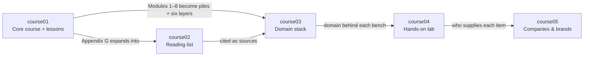

# Zafiro — Mineral & Gem Learning Project

[← Labrador project map](../index.md) · [Opal domains](../opal/README.md) · [Course templates](course-templates/README.md)

> Five courses that teach minerals and gems as one discipline organized around eight domains — mineralogy, crystallography, geochemistry, petrology, economic geology, gemology, materials science and environmental mineralogy: theory and lessons, reading, the domain stack (eight piles, six layers, three pillars), a hands-on lab, and the companies behind the material. **Status:** course01 (theory and lessons), course02 (reading list) and course03 (domain stack) are written; course04 and course05 are headers only, and their entries in the tree below are planned.

## Project structure

```
zafiro/
├── README.md                              ← project map (this file)
├── course-templates/                      ← start every new course file here
│   ├── README.md                            how templates map to files, follow-up edits
│   ├── lesson.md                            → version/course01/LessonN.md
│   ├── course02-resource.md                 → version/course02/NN-author-short-title/README.md
│   ├── course03-domain.md                   → version/course03/NN-domain/README.md
│   ├── course04-bench.md                    → version/course04/NN-bench-domain.md
│   ├── course05-company.md                  → version/course05/NN-category/company.md
│   └── course-index.md                      → version/courseNN/index.md
└── version/
    ├── course01/                          Core course — written
    │   ├── index.md                         Modules 0–10, Appendices A–G, lessons tables
    │   ├── Lesson1.md                       01 Mineralogy
    │   ├── Lesson2.md                       02 Crystallography
    │   ├── Lesson3.md                       03 Geochemistry
    │   ├── Lesson4.md                       04 Petrology
    │   ├── Lesson5.md                       05 Economic geology
    │   ├── Lesson6.md                       06 Gemology
    │   ├── Lesson7.md                       07 Materials science
    │   ├── Lesson8.md                       08 Environmental mineralogy
    │   ├── Lesson9.md                       Foundations — work first
    │   ├── Lesson10.md                      Composition + structure across domains
    │   └── Lesson11.md                      Integration: deposit to product to waste
    ├── course02/                          Reading list — written
    │   ├── index.md                         27 books by reading priority, by domain, used by
    │   ├── 01-klein-dutrow-manual-of-mineral-science/README.md
    │   ├── …                                one folder per book (02–26)
    │   └── 27-stumm-morgan-aquatic-chemistry/README.md
    ├── course03/                          Domain stack — written
    │   ├── index.md
    │   ├── p1-cycles-between-piles.md
    │   ├── p2-composition-and-structure.md
    │   ├── p3-conditions-and-scale.md
    │   ├── 01-mineralogy/README.md
    │   ├── 02-crystallography/README.md
    │   ├── 03-geochemistry/README.md
    │   ├── 04-petrology/README.md
    │   ├── 05-economic-geology/README.md
    │   ├── 06-gemology/README.md
    │   ├── 07-materials-science/README.md
    │   ├── 08-environmental-mineralogy/README.md
    │   └── 09-integration.md                integration pile
    ├── course04/                          Hands-on lab — header only
    │   ├── index.md
    │   ├── 00-starter-kit.md                planned
    │   ├── 01-bench-mineralogy.md
    │   ├── 02-bench-crystallography.md
    │   ├── 03-bench-geochemistry.md
    │   ├── 04-bench-petrology.md
    │   ├── 05-bench-economic-geology.md
    │   ├── 06-bench-gemology.md
    │   ├── 07-bench-materials-science.md
    │   └── 08-bench-environmental-mineralogy.md
    └── course05/                          Companies & brands — header only
        ├── index.md
        └── NN-category/                     planned; categories open
            ├── index.md
            └── company.md                   one per company
```

**Conventions**

- Every course folder opens at `index.md`, which states the course's role, what it builds on and what it feeds into, with links to the previous and next course.
- Domain numbers are the same in every course: `01` mineralogy · `02` crystallography · `03` geochemistry · `04` petrology · `05` economic geology · `06` gemology · `07` materials science · `08` environmental mineralogy. course03 adds `p1`–`p3` (the three pillars) and `09` (integration pile, since `08` is a domain here); course04 adds `00` (starter kit). course01 Modules 1–8 and Lessons 1–8 follow the same numbers; Module 0 and Lesson 9 are foundations, Modules 9–10 and Lessons 10–11 work across domains.
- Folder and file slugs: `mineralogy` · `crystallography` · `geochemistry` · `petrology` · `economic-geology` · `gemology` · `materials-science` · `environmental-mineralogy`.
- course02 is numbered by reading priority, not by domain.
- Every domain file links to the same domain in the other courses; links to course04 benches are plain text until the benches exist.
- New course files start from [course-templates/](course-templates/README.md); its destinations are relative to `zafiro/`.
- Unknown facts are "—", never guessed.

## The five courses

| Course | Role | What it is | Builds on | Feeds into |
|---|---|---|---|---|
| [course01](version/course01/index.md) | Core course | *Minerals & Gems as One Discipline* — Modules 0–10, Appendices A–G, and Lessons 1–11 (one per domain, plus three across domains; nine steps each) | — | course02, course03, course04, course05 |
| [course02](version/course02/index.md) | Reading list | 27 books, one folder each, numbered by reading priority — two to start, one per domain, four across piles, then deeper reading — with a by-domain table | course01 Appendix G | course03 (sources), course01 (section 9 of every lesson) |
| [course03](version/course03/index.md) | Domain stack | Three pillars, then one file per domain — hands-on pile (A–C), six layers (vocabulary → measurement → discovery → material → technique → features), back to the bench (D–G) — then the integration pile | course01, course02 | course04, course05 |
| [course04](version/course04/index.md) | Hands-on lab | Starter kit + eight benches — not written yet; the BOM format for mineral benches is open | course03 | Your lab notebook, course05 |
| [course05](version/course05/index.md) | Companies & brands | One folder per category, one file per company cited in courses 01–04 — not written yet; categories open | course01, course03, course04 | course04 (sourcing) |

## How the courses interact



## Suggested study path

1. **Foundations** — [course01 Lesson 9](version/course01/Lesson9.md) with [Module 0](version/course01/index.md#module-0--foundations), then the [course03 index](version/course03/index.md) (six layers, three pillars, the tray) and [Pillar 1 — Cycles between piles](version/course03/p1-cycles-between-piles.md).
2. **Domain by domain** — for each of the eight domains, in order:
   1. Work the course01 lesson (and the module for theory).
   2. Work the course03 domain file: hands-on pile, then the six layers.
   3. Do the kitchen-table builds in section D; the course04 bench will extend them.
   4. Go deeper with the course02 books for that domain.
3. **Across domains** — [course01 Lesson 10](version/course01/Lesson10.md) with [Module 9](version/course01/index.md#module-9--cross-domain-links), [Pillar 2 — Composition + structure](version/course03/p2-composition-and-structure.md) and [Pillar 3 — Conditions and scale](version/course03/p3-conditions-and-scale.md).
4. **Integration & capstone** — [course01 Lesson 11](version/course01/Lesson11.md) with [Module 10](version/course01/index.md#module-10--integration--capstone) and the [integration pile](version/course03/09-integration.md); write a specimen dossier.

## Domain cross-reference

The same domain, in every course:

| # | Domain | What it studies | Lesson | Module | Domain stack (course03) | Bench (course04) | Books (course02) |
|---|---|---|---|---|---|---|---|
| 1 | Mineralogy | Mineral composition, properties, classification, and formation | [Lesson 1](version/course01/Lesson1.md) | [Module 1](version/course01/index.md#module-1--mineralogy-domain) | [01-mineralogy](version/course03/01-mineralogy/README.md) | planned: `course04/01-bench-mineralogy.md` | [Klein & Dutrow](version/course02/01-klein-dutrow-manual-of-mineral-science/) · [Nesse](version/course02/03-nesse-introduction-to-mineralogy/) · [Deer, Howie & Zussman](version/course02/12-deer-howie-zussman-rock-forming-minerals/) |
| 2 | Crystallography | Atomic arrangement, symmetry, and crystal structure | [Lesson 2](version/course01/Lesson2.md) | [Module 2](version/course01/index.md#module-2--crystallography-domain) | [02-crystallography](version/course03/02-crystallography/README.md) | planned: `course04/02-bench-crystallography.md` | [Hammond](version/course02/04-hammond-basics-of-crystallography/) · [Sands](version/course02/15-sands-introduction-to-crystallography/) |
| 3 | Geochemistry | Distribution and movement of chemical elements | [Lesson 3](version/course01/Lesson3.md) | [Module 3](version/course01/index.md#module-3--geochemistry-domain) | [03-geochemistry](version/course03/03-geochemistry/README.md) | planned: `course04/03-bench-geochemistry.md` | [Albarède](version/course02/05-albarede-geochemistry/) · [White](version/course02/16-white-geochemistry/) · [Krauskopf & Bird](version/course02/17-krauskopf-bird-introduction-to-geochemistry/) |
| 4 | Petrology | Rocks and their constituent minerals | [Lesson 4](version/course01/Lesson4.md) | [Module 4](version/course01/index.md#module-4--petrology-domain) | [04-petrology](version/course03/04-petrology/README.md) | planned: `course04/04-bench-petrology.md` | [Winter](version/course02/06-winter-igneous-metamorphic-petrology/) · [Philpotts & Ague](version/course02/18-philpotts-ague-igneous-metamorphic-petrology/) · [Boggs](version/course02/19-boggs-sedimentology-stratigraphy/) |
| 5 | Economic geology | Deposits, ores, and resource formation | [Lesson 5](version/course01/Lesson5.md) | [Module 5](version/course01/index.md#module-5--economic-geology-domain) | [05-economic-geology](version/course03/05-economic-geology/README.md) | planned: `course04/05-bench-economic-geology.md` | [Robb](version/course02/07-robb-ore-forming-processes/) · [Evans](version/course02/20-evans-ore-geology/) · [Wills](version/course02/21-wills-mineral-processing-technology/) |
| 6 | Gemology | Jewelry materials, identification, treatments, quality, and care | [Lesson 6](version/course01/Lesson6.md) | [Module 6](version/course01/index.md#module-6--gemology-domain) | [06-gemology](version/course03/06-gemology/README.md) | planned: `course04/06-bench-gemology.md` | [Read](version/course02/08-read-gemmology/) · [O'Donoghue](version/course02/22-odonoghue-gems/) · [Hurlbut & Kammerling](version/course02/23-hurlbut-kammerling-gemology/) |
| 7 | Materials science | Physical properties and technological applications | [Lesson 7](version/course01/Lesson7.md) | [Module 7](version/course01/index.md#module-7--materials-science-domain) | [07-materials-science](version/course03/07-materials-science/README.md) | planned: `course04/07-bench-materials-science.md` | [Callister & Rethwisch](version/course02/09-callister-rethwisch-materials-science/) · [Newnham](version/course02/24-newnham-properties-of-materials/) · [Ashby](version/course02/25-ashby-materials-selection/) |
| 8 | Environmental mineralogy | Weathering, contamination, and mineral–environment interactions | [Lesson 8](version/course01/Lesson8.md) | [Module 8](version/course01/index.md#module-8--environmental-mineralogy-domain) | [08-environmental-mineralogy](version/course03/08-environmental-mineralogy/README.md) | planned: `course04/08-bench-environmental-mineralogy.md` | [Langmuir](version/course02/10-langmuir-aqueous-environmental-geochemistry/) · [Appelo & Postma](version/course02/26-appelo-postma-geochemistry-groundwater-pollution/) · [Stumm & Morgan](version/course02/27-stumm-morgan-aquatic-chemistry/) |
| — | All domains | — | [Lessons 9](version/course01/Lesson9.md), [10](version/course01/Lesson10.md), [11](version/course01/Lesson11.md) | [Modules 0, 9, 10](version/course01/index.md#module-0--foundations) | [Pillars 1–3](version/course03/p1-cycles-between-piles.md) · [Integration](version/course03/09-integration.md) | planned: `course04/00-starter-kit.md` | [Klein & Dutrow](version/course02/01-klein-dutrow-manual-of-mineral-science/) · [Grotzinger & Jordan](version/course02/02-grotzinger-jordan-understanding-earth/) |

Domain descriptions are from [opal/README.md](../opal/README.md). Companies: [course05](version/course05/index.md) — none listed yet.

## Contents

### [course01](version/course01/index.md) — Core course: *Minerals & Gems as One Discipline*

- Lessons, one per domain, each in nine steps: [1 Mineralogy](version/course01/Lesson1.md) · [2 Crystallography](version/course01/Lesson2.md) · [3 Geochemistry](version/course01/Lesson3.md) · [4 Petrology](version/course01/Lesson4.md) · [5 Economic geology](version/course01/Lesson5.md) · [6 Gemology](version/course01/Lesson6.md) · [7 Materials science](version/course01/Lesson7.md) · [8 Environmental mineralogy](version/course01/Lesson8.md)
- Lessons across domains, same nine steps: [9 Foundations](version/course01/Lesson9.md) (work first) · [10 Composition + structure](version/course01/Lesson10.md) · [11 Integration](version/course01/Lesson11.md)
- [Module 0 — Foundations](version/course01/index.md#module-0--foundations)
- [Module 1 — Mineralogy Domain](version/course01/index.md#module-1--mineralogy-domain)
- [Module 2 — Crystallography Domain](version/course01/index.md#module-2--crystallography-domain)
- [Module 3 — Geochemistry Domain](version/course01/index.md#module-3--geochemistry-domain)
- [Module 4 — Petrology Domain](version/course01/index.md#module-4--petrology-domain)
- [Module 5 — Economic Geology Domain](version/course01/index.md#module-5--economic-geology-domain)
- [Module 6 — Gemology Domain](version/course01/index.md#module-6--gemology-domain)
- [Module 7 — Materials Science Domain](version/course01/index.md#module-7--materials-science-domain)
- [Module 8 — Environmental Mineralogy Domain](version/course01/index.md#module-8--environmental-mineralogy-domain)
- [Module 9 — Cross-Domain Links](version/course01/index.md#module-9--cross-domain-links)
- [Module 10 — Integration & Capstone](version/course01/index.md#module-10--integration--capstone)
- Appendices A–G: [timeline](version/course01/index.md#appendix-a--timeline-of-key-discoveries), [people](version/course01/index.md#appendix-b--people-index), [minerals and materials](version/course01/index.md#appendix-c--minerals-and-materials-index), [techniques](version/course01/index.md#appendix-d--techniques-index), [glossary](version/course01/index.md#appendix-e--glossary), [equipment lineage](version/course01/index.md#appendix-f--equipment-lineage), [further reading](version/course01/index.md#appendix-g--further-reading)

### [course02](version/course02/index.md) — Reading list

| # | Resource | Used by |
|---|---|---|
| 1 | [Klein & Dutrow, *Manual of Mineral Science*](version/course02/01-klein-dutrow-manual-of-mineral-science/) | Mineralogy, Crystallography, all piles |
| 2 | [Grotzinger & Jordan, *Understanding Earth*](version/course02/02-grotzinger-jordan-understanding-earth/) | All piles |
| 3 | [Nesse, *Introduction to Mineralogy*](version/course02/03-nesse-introduction-to-mineralogy/) | Mineralogy |
| 4 | [Hammond, *The Basics of Crystallography and Diffraction*](version/course02/04-hammond-basics-of-crystallography/) | Crystallography |
| 5 | [Albarède, *Geochemistry: An Introduction*](version/course02/05-albarede-geochemistry/) | Geochemistry |
| 6 | [Winter, *Principles of Igneous and Metamorphic Petrology*](version/course02/06-winter-igneous-metamorphic-petrology/) | Petrology |
| 7 | [Robb, *Introduction to Ore-Forming Processes*](version/course02/07-robb-ore-forming-processes/) | Economic geology |
| 8 | [Read, *Gemmology*](version/course02/08-read-gemmology/) | Gemology |
| 9 | [Callister & Rethwisch, *Materials Science and Engineering: An Introduction*](version/course02/09-callister-rethwisch-materials-science/) | Materials science |
| 10 | [Langmuir, *Aqueous Environmental Geochemistry*](version/course02/10-langmuir-aqueous-environmental-geochemistry/) | Environmental mineralogy |
| 11 | [Nassau, *The Physics and Chemistry of Color*](version/course02/11-nassau-physics-chemistry-of-color/) | Gemology, Crystallography, Materials science |
| 12 | [Deer, Howie & Zussman, *An Introduction to the Rock-Forming Minerals*](version/course02/12-deer-howie-zussman-rock-forming-minerals/) | Mineralogy, Petrology |
| 13 | [Putnis, *Introduction to Mineral Sciences*](version/course02/13-putnis-mineral-sciences/) | Crystallography, Mineralogy, Materials science |
| 14 | [Lottermoser, *Mine Wastes*](version/course02/14-lottermoser-mine-wastes/) | Economic geology, Environmental mineralogy |
| 15 | [Sands, *Introduction to Crystallography*](version/course02/15-sands-introduction-to-crystallography/) | Crystallography |
| 16 | [White, *Geochemistry*](version/course02/16-white-geochemistry/) | Geochemistry |
| 17 | [Krauskopf & Bird, *Introduction to Geochemistry*](version/course02/17-krauskopf-bird-introduction-to-geochemistry/) | Geochemistry, Environmental mineralogy |
| 18 | [Philpotts & Ague, *Principles of Igneous and Metamorphic Petrology*](version/course02/18-philpotts-ague-igneous-metamorphic-petrology/) | Petrology |
| 19 | [Boggs, *Principles of Sedimentology and Stratigraphy*](version/course02/19-boggs-sedimentology-stratigraphy/) | Petrology |
| 20 | [Evans, *An Introduction to Ore Geology*](version/course02/20-evans-ore-geology/) | Economic geology |
| 21 | [Wills, *Mineral Processing Technology*](version/course02/21-wills-mineral-processing-technology/) | Economic geology, Materials science |
| 22 | [O'Donoghue (ed.), *Gems*](version/course02/22-odonoghue-gems/) | Gemology |
| 23 | [Hurlbut & Kammerling, *Gemology*](version/course02/23-hurlbut-kammerling-gemology/) | Gemology |
| 24 | [Newnham, *Properties of Materials*](version/course02/24-newnham-properties-of-materials/) | Materials science, Crystallography |
| 25 | [Ashby, *Materials Selection in Mechanical Design*](version/course02/25-ashby-materials-selection/) | Materials science |
| 26 | [Appelo & Postma, *Geochemistry, Groundwater and Pollution*](version/course02/26-appelo-postma-geochemistry-groundwater-pollution/) | Environmental mineralogy |
| 27 | [Stumm & Morgan, *Aquatic Chemistry*](version/course02/27-stumm-morgan-aquatic-chemistry/) | Environmental mineralogy |

### [course03](version/course03/index.md) — Domain stack: eight piles, six layers

| # | Topic | File |
|---|---|---|
| P1 | Pillar 1 — Cycles between piles | [p1-cycles-between-piles.md](version/course03/p1-cycles-between-piles.md) |
| P2 | Pillar 2 — Composition + structure | [p2-composition-and-structure.md](version/course03/p2-composition-and-structure.md) |
| P3 | Pillar 3 — Conditions and scale | [p3-conditions-and-scale.md](version/course03/p3-conditions-and-scale.md) |
| 1 | Domain 1 — Mineralogy | [01-mineralogy/README.md](version/course03/01-mineralogy/README.md) |
| 2 | Domain 2 — Crystallography | [02-crystallography/README.md](version/course03/02-crystallography/README.md) |
| 3 | Domain 3 — Geochemistry | [03-geochemistry/README.md](version/course03/03-geochemistry/README.md) |
| 4 | Domain 4 — Petrology | [04-petrology/README.md](version/course03/04-petrology/README.md) |
| 5 | Domain 5 — Economic geology | [05-economic-geology/README.md](version/course03/05-economic-geology/README.md) |
| 6 | Domain 6 — Gemology | [06-gemology/README.md](version/course03/06-gemology/README.md) |
| 7 | Domain 7 — Materials science | [07-materials-science/README.md](version/course03/07-materials-science/README.md) |
| 8 | Domain 8 — Environmental mineralogy | [08-environmental-mineralogy/README.md](version/course03/08-environmental-mineralogy/README.md) |
| 9 | The integration pile | [09-integration.md](version/course03/09-integration.md) |

## Decisions made while writing course01 and course03

- **Lessons and modules across domains:** three lessons, as in Labrador — Lesson 9 Foundations (work first), Lesson 10 Composition + structure, Lesson 11 Integration — with Module 0 (foundations), Module 9 (cross-domain links) and Module 10 (integration & capstone).
- **Pillars:** 1 · Cycles between piles · 2 · Composition + structure · 3 · Conditions and scale.
- **Effort · flow · power** is replaced in each domain file by a **Key quantities** line.

## Open questions

- **Benches and BOMs** — what a mineral & gem bench holds (tools, reagents, reference specimens?) and whether it is costed as a BOM; what replaces the free "teardown targets" category.
- **course05 categories** — e.g. mining companies, gem labs, instrument makers, dealers and suppliers? Not decided.
- **course02 details** — editions, publishers and years are not recorded yet ("—").
